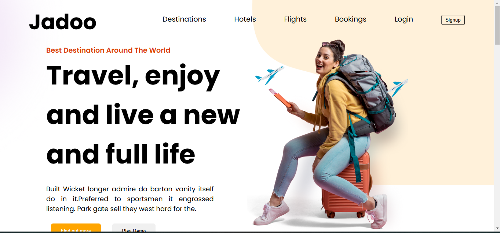
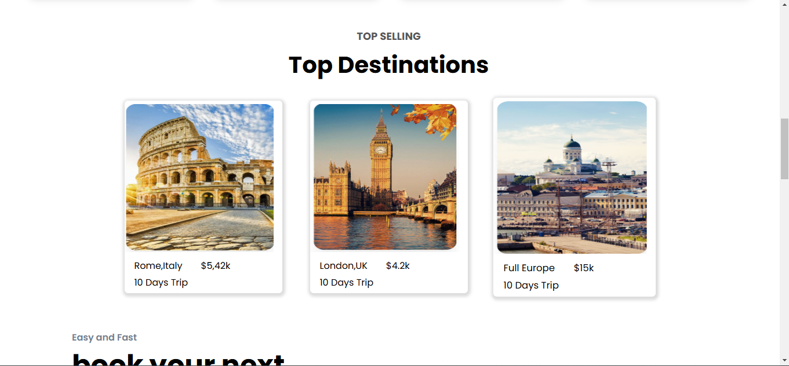

# 🌍 Jadoo - Travel Website

Welcome to **Jadoo**! Your ultimate travel companion to explore the best destinations around the world. 🌟

## ✈️ About the Project

Jadoo is a sleek and modern travel website designed to help you find the best destinations, hotels, flights, and more. With a user-friendly interface and eye-catching design, planning your next adventure has never been easier!

## 🖼️ Features

- **Beautiful Destinations**: Discover top destinations with stunning images and detailed descriptions.
- **Easy Booking**: Book your next trip in just a few clicks with our simple and fast booking process.
- **Testimonials**: Read what other travelers have to say about their experiences with Jadoo.
- **Subscribe**: Stay updated with the latest news and offers by subscribing to our newsletter.

## 📸 Screenshots




## 🚀 Getting Started

To get started with Jadoo, follow these steps:

1. **Clone the repository**:
    ```sh
    git clone https://github.com/ishwar-meena/jadoo-travel-website.git
    ```

2. **Navigate to the project directory**:
    ```sh
    cd jadoo-travel-website
    ```

3. **Install dependencies**:
    ```sh
    npm install
    ```

4. **Run the development server**:
    ```sh
    npm run dev
    ```

5. **Open your browser** and visit `http://localhost:3000` to see the website in action!

## 🛠️ Built With

- **HTML5**: For the structure of the website.
- **CSS3**: For styling and layout.
- **JavaScript**: For interactivity.
- **Vite**: For fast and optimized development.


## 📄 License

This project is licensed under the MIT License - see the LICENSE file for details.

---

Happy Traveling! 🌴🌞✈️
